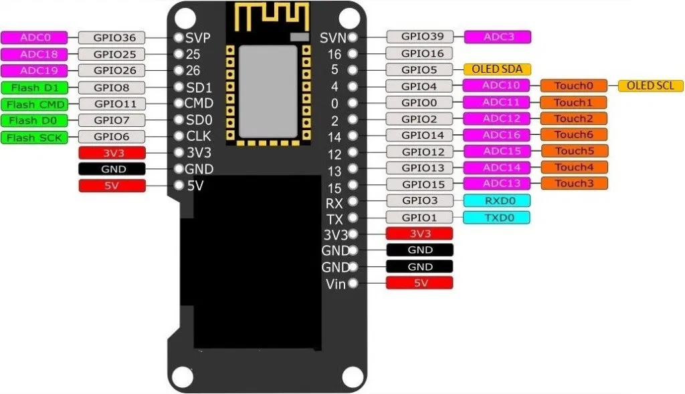
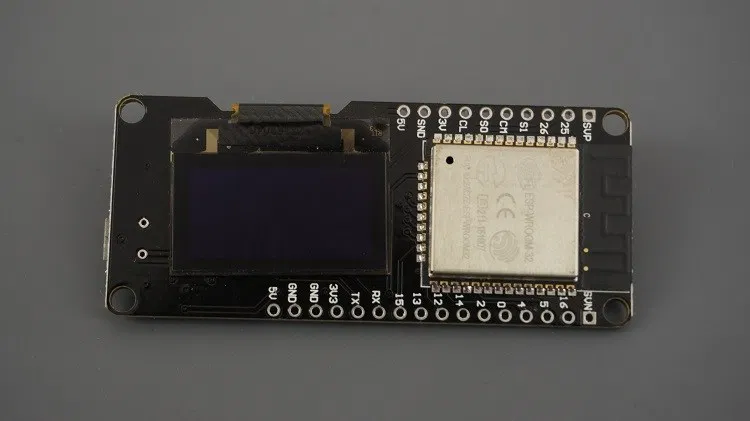
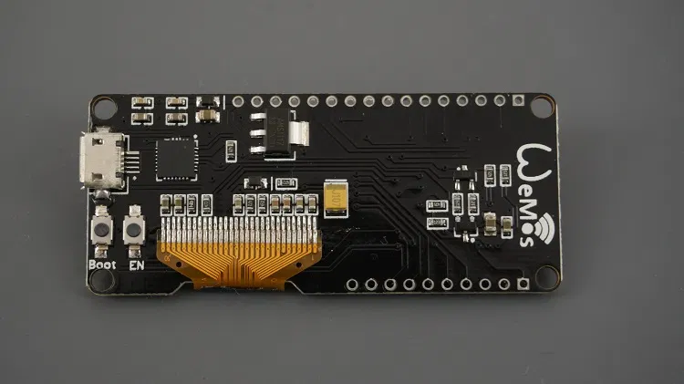
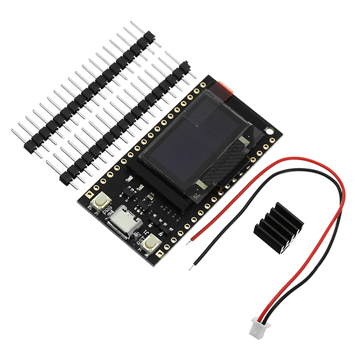
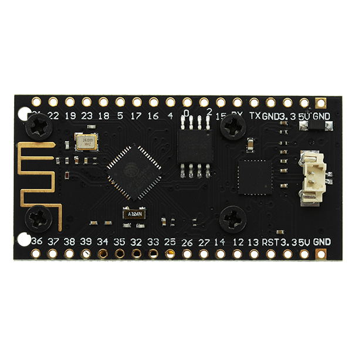
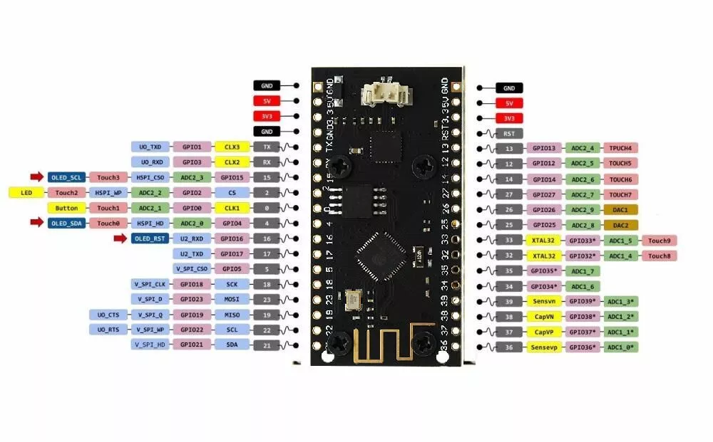
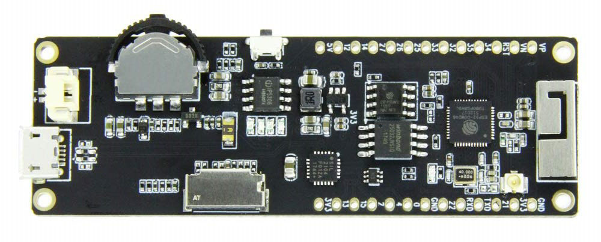
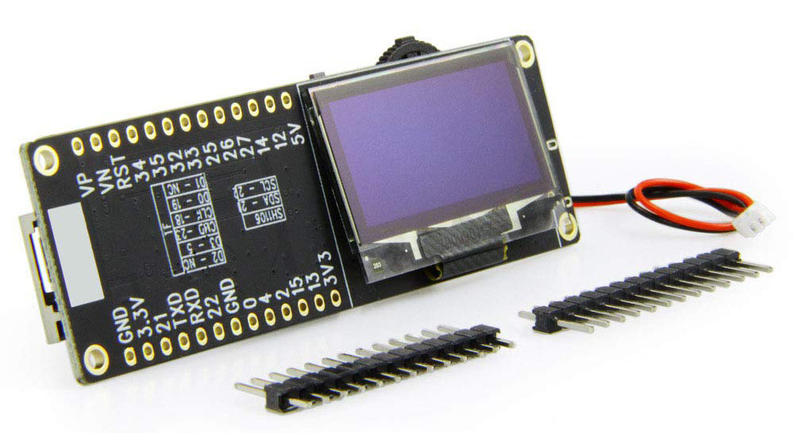
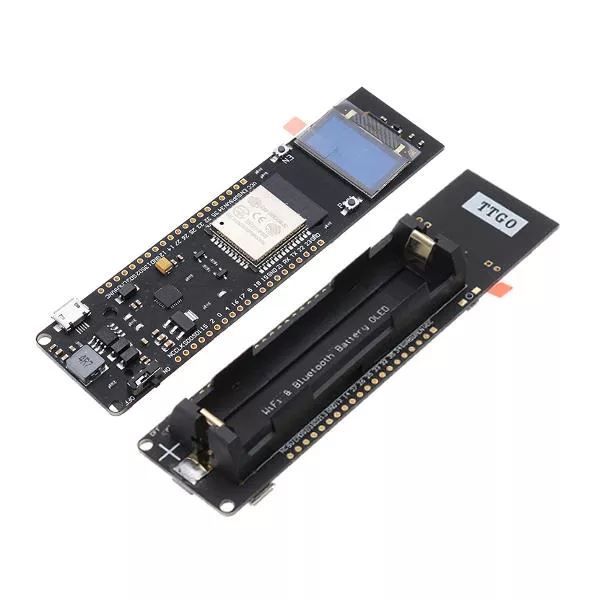
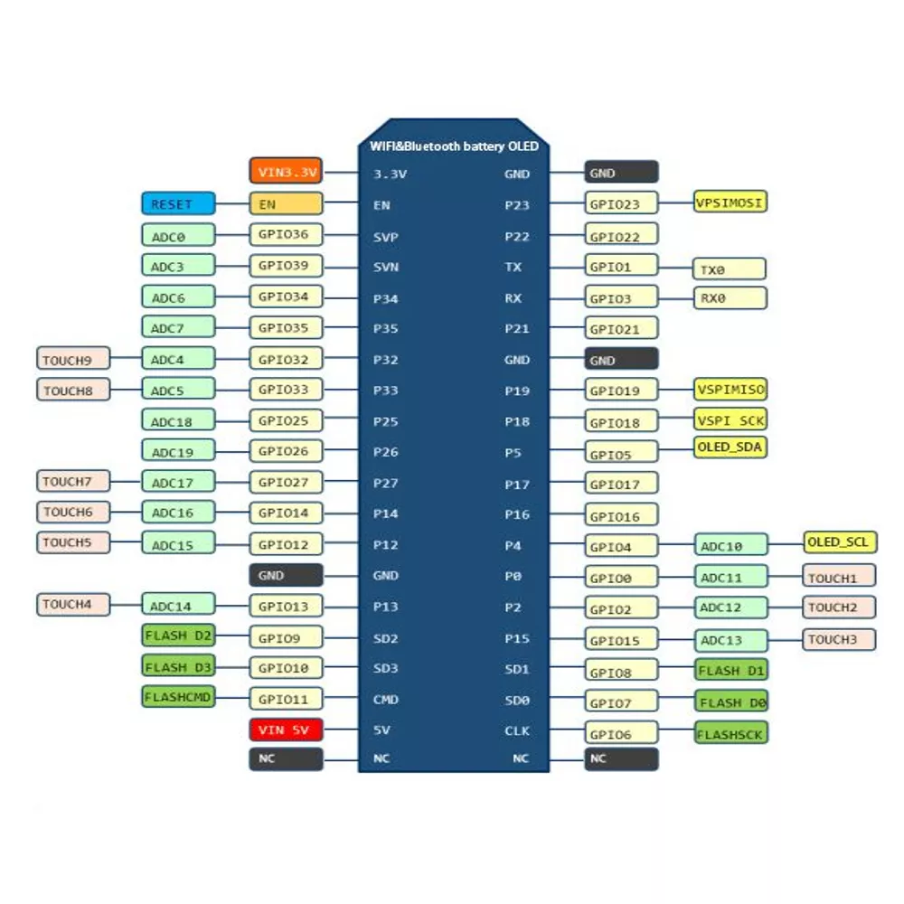

## Green Board

```c
static const uint8_t OLED_CS = 27;
static const uint8_t OLED_DC = 26;

static const uint8_t OLED_RESET = 25;
static const uint8_t OLED_SDA = 33;
static const uint8_t OLED_SCL = 32;
static const uint16_t OLED_ADDR = 0x3C;

static const uint8_t LED_BUILTIN = 2;
```

## LOLIN ESP32 OLED

ESP32 and built-in 0.96 inch 128×64 I2C OLED display.

```c
static const uint8_t OLED_RESET = 16;
static const uint8_t OLED_SDA = 5;
static const uint8_t OLED_SCL = 4;
static const uint16_t OLED_ADDR = 0x3C;

static const uint8_t LED_BUILTIN = -1;
```





## TTGO OLED

### Device description on banggood

1. The main control chip using Le Xin ESP32, Tensilica LX6 dual core processor, clocked at 240MHz, computing capacity of up to 600DMIPS,
520 SRAM, 802.11 KB chip b/g/n HT40 Wi-Fi transceiver, baseband, and LWIP protocol stack, Bluetooth (Bluetooth dual-mode integrated
traditional and BLE low-power Bluetooth).
2. onboard 16 Mt bytes (128 Mt bit), Flash, and Wi-Fi antennas
3. 0.96 inch White OLED display
4. lithium battery charging circuit and interface
5. CP2102 USB to serial chip, perfect support for Arduino development environment

### PCB characteristics

- poor rf design, display holding screws too near to wifi antenna (one of them is touching it)

```c
static const uint8_t OLED_RESET = 16;
static const uint8_t OLED_SDA = 4;
static const uint8_t OLED_SCL = 15;
static const uint16_t OLED_ADDR = 0x3C;

static const uint8_t LED_BUILTIN = 2;
```





## TTGO T-Eight OLED

T-Eight Esp32 SH1106 1.3 inch OLED Display Screen IPEX 3D Antenna 4MB SPI Flash 4MB Psram MicroSD JST-Bat

```c
static const uint8_t PSRAM_CS = 16;
static const uint8_t PSRAM_CLK = 17;

static const uint8_t TF_D0 = 2;
static const uint8_t TF_D1 = -1;
static const uint8_t TF_D2 = -1;
static const uint8_t TF_D3 = 13;
static const uint8_t TF_CMD = 15;
static const uint8_t TF_CLK = 14;

static const uint8_t OLED_SDA = 21;
static const uint8_t OLED_SCL = 22;
static const uint16_t OLED_ADDR = 0x3C;

static const uint8_t BTN_A = 39;
static const uint8_t BTN_B = 38;
static const uint8_t BTN_C = 37;

static const uint8_t LED_BUILTIN = -1;
```




## TTGO OLED 18650

Dimensions: 28.25mm x 114mm x 17.6mm

- 18650 charging system integrated.
- indicate LED inside(Green means full& Red means charging)
- Charging and working could be at the same time.
- 1 Switch could control the power.
- 1 extra LED could be programmed(Connected with GPIO16[D0])
- 0.5A charging current
- 1A output
- Over charge protection
- Over discharge protection
- Full ESP32 pins break out

```c
static const uint8_t OLED_RESET = -1;
static const uint8_t OLED_SDA = 5;
static const uint8_t OLED_SCL = 4;
static const uint16_t OLED_ADDR = 0x3C;

static const uint8_t LED_BUILTIN = 16;

static const uint8_t VSPI_MISO = 19;
static const uint8_t VSPI_MOSI = 23;
static const uint8_t VSPI_SCK = 18;


static const uint8_t TF_D0 = 7;
static const uint8_t TF_D1 = 8;
static const uint8_t TF_D2 = 9;
static const uint8_t TF_D3 = 10;
static const uint8_t TF_CMD = 11;
static const uint8_t TF_CLK = 6;
```


